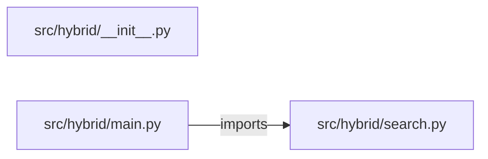

# hybrid-search-rag — project architecture

[README](README.md) · [Interview questions and answers](INTERVIEW_QA.md)

## Purpose and scope

Markdown files in `corpus/` are split into paragraphs, each tagged with its file, first line, and heading. A question is ranked two ways:

This document describes files and symbols in this checkout. Deployment templates and statements in the original overview are distinguished from a verified running environment.

## Component diagram



For Python repositories, arrows show resolved local imports, not network calls or deployment order. Otherwise the diagram is a repository component map; containment arrows do not assert runtime integration.

## Components and responsibilities

| Component | Responsibility |
| --- | --- |
| [`src/hybrid/main.py`](src/hybrid/main.py) | HTTP handlers: `GET /healthz`, `GET /sources`, `POST /ask` |
| [`src/hybrid/search.py`](src/hybrid/search.py) | Functions: `stem`, `tokens`, `embed`, `chunk`, `load_corpus`, `bm25_scores`, `rrf` |
| [`requirements.txt`](requirements.txt) | Implementation or supporting configuration |
| [`src/hybrid/__init__.py`](src/hybrid/__init__.py) | Implementation or supporting configuration |
| [`tests/test_hybrid.py`](tests/test_hybrid.py) | Executable checks and regression examples |
| [`.github/workflows/ci.yml`](.github/workflows/ci.yml) | GitHub Actions job definitions |
| [`README.md`](README.md) | Project explanations or operating notes |
| [`corpus/budget.md`](corpus/budget.md) | Project explanations or operating notes |
| [`corpus/oncall.md`](corpus/oncall.md) | Project explanations or operating notes |

## Request interface

| Method and path | Handler | Source |
| --- | --- | --- |
| `GET /healthz` | `healthz` | [`src/hybrid/main.py`](src/hybrid/main.py#L9) |
| `GET /sources` | `sources` | [`src/hybrid/main.py`](src/hybrid/main.py#L14) |
| `POST /ask` | `post_ask` | [`src/hybrid/main.py`](src/hybrid/main.py#L22) |

The table lists literal route decorators found in the inspected Python modules. Router prefixes and middleware can add behavior; check the linked handler and application setup before calling an endpoint.

## Implementation walkthrough

### `search(question, mode='hybrid', top_k=3, source=None)`

Source: [`src/hybrid/search.py`](src/hybrid/search.py#L99).

Calls visible in this function: `', '.join`, `SearchError`, `bm25_scores`, `embed`, `enumerate`, `fused.setdefault`, `hits.append`, `isinstance`, `len`, `load_corpus`, `question.strip`, `range`.

```python
def search(question, mode="hybrid", top_k=3, source=None):
    if not isinstance(question, str) or not question.strip():
        raise SearchError("question is empty")
    if mode not in MODES:
        raise SearchError(f"mode must be one of {', '.join(sorted(MODES))}")
    if not isinstance(top_k, int) or not 1 <= top_k <= 10:
        raise SearchError("top_k must be from 1 to 10")
    passages = load_corpus()
    if source is not None:
        if source not in {p["source"] for p in passages}:
            raise SearchError(f"unknown source: {source}")
        passages = [p for p in passages if p["source"] == source]

    texts = [p["text"] for p in passages]
    keyword = bm25_scores(question, texts)
    query = embed(question)
    dense = [sum(a * b for a, b in zip(query, embed(text))) for text in texts]
    by_bm25 = sorted(range(len(passages)), key=lambda i: (-keyword[i], i))
    by_dense = sorted(range(len(passages)), key=lambda i: (-dense[i], i))
    bm25_rank = {i: rank for rank, i in enumerate(by_bm25, start=1)}
    dense_rank = {i: rank for rank, i in enumerate(by_dense, start=1)}

```

The excerpt is truncated; the linked source contains the full implementation.

### `chunk(name, text)`

Source: [`src/hybrid/search.py`](src/hybrid/search.py#L37).

Calls visible in this function: `' '.join`, `buffer.append`, `chunks.append`, `enumerate`, `flush`, `line.strip`, `stripped.lstrip`, `stripped.lstrip('#').strip`, `stripped.startswith`, `text.splitlines`.

```python
def chunk(name, text):
    heading = None
    chunks = []
    lines = text.splitlines()
    start = None
    buffer = []

    def flush():
        if buffer:
            chunks.append({"source": name, "line": start, "heading": heading, "text": " ".join(buffer)})

    for number, line in enumerate(lines, start=1):
        stripped = line.strip()
        if stripped.startswith("#"):
            flush()
            buffer, start = [], None
            heading = stripped.lstrip("#").strip()
        elif not stripped:
            flush()
            buffer, start = [], None
        else:
            if start is None:
```

The excerpt is truncated; the linked source contains the full implementation.

### `bm25_scores(query, documents)`

Source: [`src/hybrid/search.py`](src/hybrid/search.py#L72).

Calls visible in this function: `items.count`, `len`, `math.log`, `scores.append`, `set`, `sum`, `tokens`.

```python
def bm25_scores(query, documents):
    doc_tokens = [tokens(document) for document in documents]
    count = len(doc_tokens)
    average = sum(len(items) for items in doc_tokens) / count if count else 0
    terms = set(tokens(query))
    df = {term: sum(term in items for items in doc_tokens) for term in terms}
    scores = []
    for items in doc_tokens:
        score = 0.0
        for term in terms:
            frequency = items.count(term)
            if not frequency:
                continue
            idf = math.log((count - df[term] + 0.5) / (df[term] + 0.5) + 1)
            score += idf * frequency * (K1 + 1) / (frequency + K1 * (1 - B + B * len(items) / average))
        scores.append(score)
    return scores
```

### `embed(text)`

Source: [`src/hybrid/search.py`](src/hybrid/search.py#L28).

Calls visible in this function: `hashlib.sha256`, `hashlib.sha256(token.encode()).digest`, `math.sqrt`, `sum`, `token.encode`, `tokens`.

```python
def embed(text):
    vector = [0.0] * DIM
    for token in tokens(text):
        digest = hashlib.sha256(token.encode()).digest()
        vector[digest[0] % DIM] += 1.0 if digest[1] % 2 == 0 else -1.0
    norm = math.sqrt(sum(value * value for value in vector)) or 1.0
    return [value / norm for value in vector]
```

## Validation and failure paths

| Explicit exception | Source |
| --- | --- |
| `HTTPException(status_code=422, detail=str(exc))` | [`src/hybrid/main.py`](src/hybrid/main.py#L26) |
| `SearchError('question is empty')` | [`src/hybrid/search.py`](src/hybrid/search.py#L101) |
| `SearchError(f"mode must be one of {', '.join(sorted(MODES))}")` | [`src/hybrid/search.py`](src/hybrid/search.py#L103) |
| `SearchError('top_k must be from 1 to 10')` | [`src/hybrid/search.py`](src/hybrid/search.py#L105) |
| `SearchError(f'unknown source: {source}')` | [`src/hybrid/search.py`](src/hybrid/search.py#L109) |

These are explicit exceptions in the inspected source, rather than a claim that every failure is handled. Follow the calling handler to see whether the exception becomes an HTTP response or propagates.

## Data and state

- [`src/hybrid/search.py`](src/hybrid/search.py) defines module-level containers: `STOP`, `MODES`.

Module-level dictionaries/lists live in a Python process. They can be fixtures or mutable state; inspect writes before treating them as persistent storage. A production extension would need to define persistence and concurrency behavior explicitly.

## Data flow and design decisions

### What is the input-to-output contract of `search`

In [`src/hybrid/search.py`](src/hybrid/search.py#L99), `search(question, mode='hybrid', top_k=3, source=None)` receives the inputs. The function computes these intermediate values:

- `passages = load_corpus()`
- `texts = [p['text'] for p in passages]`
- `keyword = bm25_scores(question, texts)`
- `query = embed(question)`
- `dense = [sum((a * b for a, b in zip(query, embed(text)))) for text in texts]`
- `by_bm25 = sorted(range(len(passages)), key=lambda i: (-keyword[i], i))`
- `by_dense = sorted(range(len(passages)), key=lambda i: (-dense[i], i))`

Its result is defined by:

- `{'answered': True, 'answer': best['text'], 'citation': f"{best['source']}:{best['line']}", 'mode': mode, 'passages': hits}`
- `{'answered': False, 'answer': 'No document shares enough terms.', 'citation': None, 'mode': mode, 'passages': hits}`

### Which decision rules or boundary conditions should an interviewer challenge

The implementation in [`src/hybrid/search.py`](src/hybrid/search.py#L99) branches on:

- `not isinstance(question, str) or not question.strip()`
- `mode not in MODES`
- `not isinstance(top_k, int) or not 1 <= top_k <= 10`
- `source is not None`
- `mode == 'bm25'`
- `not hits or hits[0]['bm25'] <= 0 or hits[0]['coverage'] < MIN_COVERAGE`
- `source not in {p['source'] for p in passages}`

A useful extension is a table-driven test that covers each condition just below, at, and above its boundary where applicable. These expressions are the current rules; changing them changes behavior and should be justified by the project’s acceptance criteria.

## Setup and verification

The following commands are derived from the checked-in dependency/test contracts. Execute them from the repository root; the block prepares a local environment, not a cloud deployment.

```bash
python3 -m venv .venv
source .venv/bin/activate
python -m pip install -r requirements.txt
python -m pytest -q
```

Python dependencies: [`requirements.txt`](requirements.txt).

Test entry points: [`tests/test_hybrid.py`](tests/test_hybrid.py).

Automation definitions: [`.github/workflows/ci.yml`](.github/workflows/ci.yml). Read their triggers and job steps to determine what CI actually runs.

## Operating boundaries and design review

Before turning this checkout into a customer deployment, establish the input contract, data ownership, access controls, failure response, evaluation criteria, and rollback owner. Repository fixtures and unit tests demonstrate local behavior; they do not establish throughput, uptime, compliance, or business impact.

A useful architecture review starts with the linked implementation: identify where input enters, where a decision is made, which state can change, and which external dependency can fail. Add a deployment view only for infrastructure that is actually configured and exercised.
